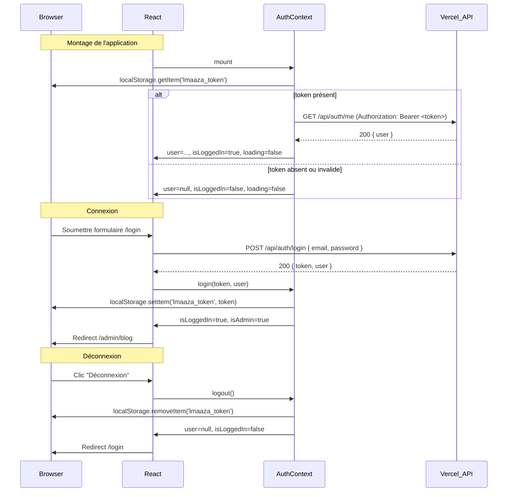
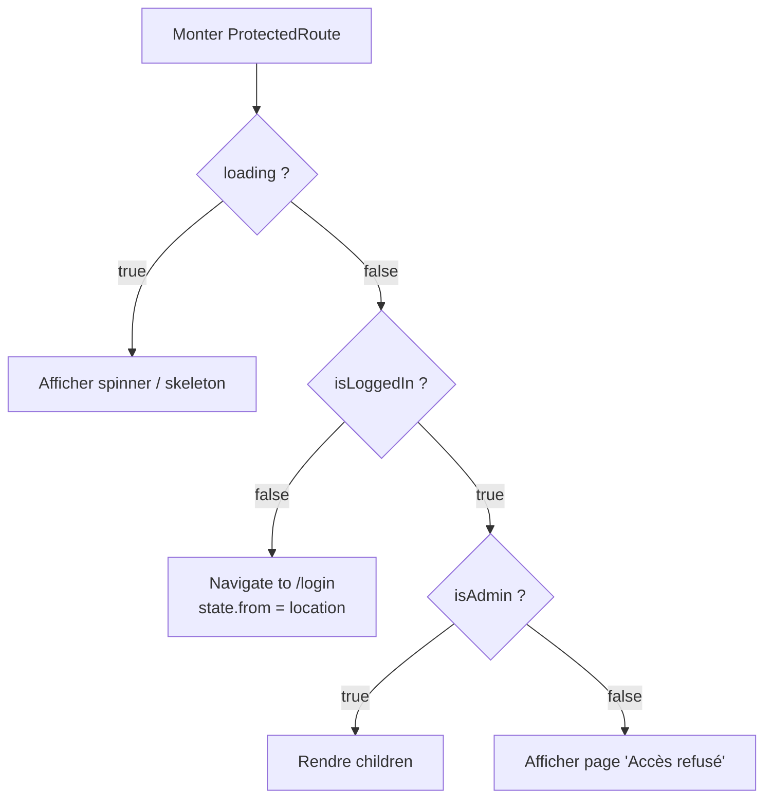

# Design Document — auth-backend

## Overview

Ce document décrit la conception technique permettant de connecter toutes les pièces de l'authentification pour la plateforme L'Maaza. L'infrastructure backend existe déjà (`api/lib/auth.js`, `api/auth/login.js`, `api/auth/me.js`) mais elle est déconnectée du frontend. La refactorisation à effectuer est principalement côté configuration et frontend.

### Périmètre des changements

| Fichier | Nature | Description |
|---|---|---|
| `vercel.json` | Modification | Exposer les routes `/api/auth/*` avant le rewrite SPA |
| `package.json` | Modification | Ajouter `jsonwebtoken` en dépendance de production + script `dev:api` |
| `src/pages/Login.jsx` | Création | Page de connexion avec formulaire email/mot de passe |
| `src/contexts/AuthContext.jsx` | Réécriture | État auth réel : appels API, `loading`, `login(token, user)`, `logout()` |
| `src/components/admin/ProtectedRoute.jsx` | Modification | Utiliser `loading`, gérer "Accès refusé", rediriger vers `/login` |
| `src/App.js` | Modification | Ajouter la route `/login` |

---

## Architecture

### Flux d'authentification global



### Architecture de routage Vercel

```
Requête HTTP
     │
     ├── /api/auth/login  ──→  api/auth/login.js (Serverless Function)
     │                              └── api/lib/auth.js → handleLogin()
     │
     ├── /api/auth/me     ──→  api/auth/me.js (Serverless Function)
     │                              └── api/lib/auth.js → handleMe()
     │
     └── /(.*)           ──→  /index.html (React SPA)
```

### Architecture de développement local

```
Browser (port 3000)
     │
     └── /api/*  ──→  src/setupProxy.js  ──→  http://localhost:3001
                                               └── server/dev-server.js
                                                    └── api/lib/auth.js (même code)
```

---

## Components and Interfaces

### 1. `vercel.json` — Configuration du routage

Le fichier `vercel.json` actuel ne contient qu'un rewrite SPA qui absorbe toutes les routes, y compris `/api/*`. La solution est d'ajouter des entrées de routes API **avant** le rewrite.

Vercel évalue les règles dans l'ordre déclaré. En plaçant les routes API en premier, elles sont capturées avant que le rewrite SPA ne s'applique.

**Structure cible :**

```json
{
  "routes": [
    {
      "src": "/api/auth/login",
      "dest": "/api/auth/login.js"
    },
    {
      "src": "/api/auth/me",
      "dest": "/api/auth/me.js"
    },
    {
      "src": "/(.*)",
      "dest": "/index.html"
    }
  ]
}
```

> **Note** : La clé `rewrites` est remplacée par `routes` pour permettre le mélange de destinations explicites et de rewrites. Les deux clés sont mutuellement exclusives dans Vercel si elles portent sur les mêmes chemins. Utiliser `routes` est la méthode recommandée pour ce cas.

### 2. `package.json` — Dépendances et scripts

**Ajout dans `dependencies` :**
```json
"jsonwebtoken": "9.0.2"
```

La version `9.0.2` est la dernière stable de la branche 9.x, compatible avec l'API utilisée dans `api/lib/auth.js` (`jwt.sign`, `jwt.verify`).

**Ajout dans `scripts` :**
```json
"dev:api": "node server/dev-server.js"
```

### 3. `src/pages/Login.jsx` — Page de connexion

**Interface du composant :**
- Props : aucune (utilise `useAuth()` et `useNavigate()` directement)
- Dépendances : `useAuth`, `useNavigate`, `useState`

**État local :**
```
email: string         — valeur du champ email
password: string      — valeur du champ mot de passe
error: string | null  — message d'erreur à afficher
loading: boolean      — état de la requête en cours
```

**Logique de validation (côté client, avant appel API) :**
1. Si `email.trim()` est vide OU `password.trim()` est vide → afficher "Veuillez remplir tous les champs."
2. Si le format email est invalide (regex basique `/.+@.+\..+/`) → afficher "Adresse email invalide."
3. Si validation OK → envoyer `POST /api/auth/login`

**Logique post-réponse :**
- `200` → appeler `auth.login(data.token, data.user)` puis `navigate('/admin/blog')`
- `401` → afficher `data.error || "Email ou mot de passe incorrect."`
- `500` / erreur réseau → afficher "Erreur de connexion. Veuillez réessayer."

**Comportement si déjà authentifié :**
- Au montage, si `isLoggedIn && !loading` → `navigate('/admin/blog', { replace: true })`

**Structure JSX :**
```
<div className="min-h-screen flex items-center justify-center bg-gray-50">
  <div className="max-w-md w-full bg-white rounded-xl shadow-lg p-8">
    <h1>Connexion</h1>
    {error && <AlertBox message={error} />}
    <form onSubmit={handleSubmit}>
      <label>Adresse email</label>
      <input type="email" placeholder="admin@lmaaza.net" />
      <label>Mot de passe</label>
      <input type="password" placeholder="••••••••" />
      <button type="submit" disabled={loading}>
        {loading ? <Spinner /> : "Se connecter"}
      </button>
    </form>
  </div>
</div>
```

### 4. `src/contexts/AuthContext.jsx` — Réécriture complète

**Interface publique (valeurs exposées par le context) :**

| Valeur | Type | Description |
|---|---|---|
| `user` | `Object \| null` | `{ id, email, name, role }` ou `null` |
| `isLoggedIn` | `boolean` | `user !== null` |
| `isAdmin` | `boolean` | `user !== null && user.role === 'admin'` |
| `loading` | `boolean` | `true` pendant la validation du token au montage |
| `login(token, user)` | `function` | Stocke le token + met à jour l'état |
| `logout()` | `function` | Efface le token + remet l'état à zéro |

**Clé de stockage :** `lmaaza_token` dans `localStorage`

**Logique d'initialisation (au montage via `useEffect`) :**

```
1. loading = true
2. token = localStorage.getItem('lmaaza_token')
3. Si token est une chaîne non vide :
   a. Appeler GET /api/auth/me avec Authorization: Bearer <token>
   b. Si 200 → user = data.user, isLoggedIn = true
   c. Si 401 / erreur réseau → localStorage.removeItem('lmaaza_token'), user = null
4. loading = false
```

**Timeout de 10 secondes** sur l'appel `/api/auth/me` via `AbortController` :
```javascript
const controller = new AbortController();
const timeoutId = setTimeout(() => controller.abort(), 10_000);
fetch('/api/auth/me', { signal: controller.signal, ... })
  .finally(() => clearTimeout(timeoutId));
```

**Fonction `login(token, user)` :**
```
localStorage.setItem('lmaaza_token', token)
setUser(user)
```

**Fonction `logout()` :**
```
try {
  localStorage.removeItem('lmaaza_token')
  setUser(null)
} catch (e) {
  // Si removeItem échoue, ne pas modifier le state (Req 7.1)
}
```

### 5. `src/components/admin/ProtectedRoute.jsx` — Mise à jour

**Arbre de décision :**



**Page "Accès refusé" (inline, sans redirection) :**
```jsx
<div className="min-h-screen flex items-center justify-center">
  <div className="text-center">
    <h1 className="text-2xl font-bold text-red-600">Accès refusé</h1>
    <p className="text-gray-600 mt-2">
      Vous n'avez pas les droits suffisants pour accéder à cette page.
    </p>
    <Link to="/" className="...">Retour à l'accueil</Link>
  </div>
</div>
```

### 6. `src/App.js` — Ajout de la route `/login`

Ajouter dans `AppRoutes()`, dans le bloc `<Routes>`, en dehors du `<Layout>` (la page login n'a pas besoin du header/footer) ou à l'intérieur selon le choix UX. La recommandation est de la garder **dans le Layout** pour la cohérence visuelle mais sans le menu de navigation principal. Si le Layout s'adapte mal, elle peut être placée avant le `<Layout>`.

**Import à ajouter :**
```javascript
import LoginPage from './pages/Login';
```

**Route à ajouter :**
```jsx
<Route path="/login" element={<LoginPage />} />
```

L'`AuthProvider` enveloppe déjà toute l'application dans `App()`, donc `LoginPage` aura accès à `useAuth()`.

---

## Data Models

### Token JWT (payload)

```json
{
  "sub": "admin-1",
  "email": "admin@lmaaza.net",
  "name": "Administrateur",
  "role": "admin",
  "iat": 1700000000,
  "exp": 1700604800
}
```

- Durée de validité : 7 jours (`7d`)
- Algorithme : HS256 (défaut de `jsonwebtoken`)
- Signé avec `JWT_SECRET` (env var)

### Objet utilisateur (côté frontend)

```typescript
interface User {
  id: string;       // "admin-1" | "user-1"
  email: string;    // email de connexion
  name: string;     // nom d'affichage
  role: 'admin' | 'user';
}
```

### Réponse de `POST /api/auth/login`

```json
{
  "token": "<jwt_string>",
  "user": {
    "id": "admin-1",
    "email": "admin@lmaaza.net",
    "name": "Administrateur",
    "role": "admin"
  }
}
```

### Réponse de `GET /api/auth/me`

```json
{
  "user": {
    "id": "admin-1",
    "email": "admin@lmaaza.net",
    "name": "Administrateur",
    "role": "admin"
  }
}
```

### Réponses d'erreur

```json
{ "error": "Email ou mot de passe incorrect" }   // 401
{ "error": "Non authentifié" }                    // 401 (me)
{ "error": "Session expirée ou invalide" }        // 401 (me, token expiré)
{ "error": "Méthode non autorisée" }              // 405
{ "error": "Erreur serveur" }                     // 500
```

---

## Correctness Properties

*Une propriété est une caractéristique ou un comportement qui doit être vrai pour toutes les exécutions valides d'un système — essentiellement, un énoncé formel de ce que le système doit faire. Les propriétés servent de pont entre les spécifications lisibles par l'humain et les garanties de correction vérifiables automatiquement.*

### Property 1: Validation des entrées du formulaire de connexion

**Validates: Requirements 3.3, 3.10**

*Pour tout* couple `(email, password)` où `email.trim()` est vide, `password.trim()` est vide, ou le format email est invalide, la soumission du formulaire de connexion ne doit pas déclencher d'appel à `POST /api/auth/login` et doit afficher un message d'erreur de validation.

---

### Property 2: Appel API avec identifiants valides

**Validates: Requirements 3.4**

*Pour tout* couple `(email, password)` où `email` est une adresse email syntaxiquement valide et `password.trim()` est non vide, la soumission du formulaire doit déclencher exactement un appel `POST /api/auth/login` avec le corps `{ email, password }`.

---

### Property 3: Stockage du token après connexion réussie

**Validates: Requirements 3.5, 5.1**

*Pour tout* token JWT renvoyé par une réponse 200 de `POST /api/auth/login`, ce token doit être stocké dans `localStorage` sous la clé exacte `lmaaza_token` immédiatement après l'appel.

---

### Property 4: Transmission de l'en-tête Authorization

**Validates: Requirements 4.2, 4.3, 5.2**

*Pour tout* token non vide présent dans `localStorage['lmaaza_token']` au montage d'`AuthContext`, l'appel à `GET /api/auth/me` doit inclure l'en-tête `Authorization` avec la valeur exacte `Bearer <token>`.

---

### Property 5: Cohérence de l'état après validation du token

**Validates: Requirements 4.4, 4.9**

*Pour tout* objet utilisateur `user` renvoyé par une réponse 200 de `GET /api/auth/me`, l'état d'`AuthContext` doit satisfaire simultanément : `context.user` est égal à `user`, `context.isLoggedIn` est `true`, et `context.loading` est `false`.

---

### Property 6: Calcul correct de isAdmin

**Validates: Requirements 4.10**

*Pour tout* objet utilisateur `user` avec n'importe quelle valeur de `user.role`, `AuthContext.isAdmin` doit être `true` si et seulement si `user.role === 'admin'`. Pour `user === null`, `isAdmin` doit être `false`.

---

### Property 7: Round-trip login/logout

**Validates: Requirements 4.6, 4.7, 7.1, 7.2**

*Pour tout* token et objet utilisateur, appeler `login(token, user)` puis `logout()` doit résulter en un état final où `localStorage.getItem('lmaaza_token')` retourne `null`, `context.user` est `null`, `context.isLoggedIn` est `false`, et `context.isAdmin` est `false`.

---

### Property 8: Rejet des valeurs de stockage invalides

**Validates: Requirements 5.4**

*Pour toute* valeur dans `localStorage['lmaaza_token']` qui n'est pas une chaîne non vide (chaîne vide, `null`, `undefined`, nombre, objet sérialisé), `AuthContext` doit traiter la session comme non authentifiée (`user=null`, `isLoggedIn=false`) sans appeler `GET /api/auth/me`.

---

### Property 9: Round-trip signe/vérifie JWT

**Validates: Requirements 8.1**

*Pour tout* objet utilisateur valide `{ id, email, name, role }` et toute valeur de `JWT_SECRET`, `verifyToken(signToken(user))` doit retourner un objet contenant les mêmes valeurs `{ id, email, name, role }` que l'objet d'entrée.

---

### Property 10: Validation des credentials depuis l'environnement

**Validates: Requirements 8.2**

*Pour toute* paire `(ADMIN_EMAIL, ADMIN_PASSWORD)` définie dans les variables d'environnement, appeler `validateCredentials(ADMIN_EMAIL, ADMIN_PASSWORD)` doit retourner un objet utilisateur non nul. Appeler `validateCredentials` avec n'importe quelle paire différente doit retourner `null`.

---

## Error Handling

### Couche API (api/lib/auth.js) — déjà implémentée

| Situation | Code HTTP | Corps JSON |
|---|---|---|
| Méthode non autorisée | 405 | `{ error: "Méthode non autorisée" }` |
| Champs email/password manquants | 400 | `{ error: "Email et mot de passe requis" }` |
| Credentials invalides | 401 | `{ error: "Email ou mot de passe incorrect" }` |
| Token absent dans l'en-tête | 401 | `{ error: "Non authentifié" }` |
| Token expiré ou invalide | 401 | `{ error: "Session expirée ou invalide" }` |
| Exception non gérée (handlers) | 500 | `{ error: "Erreur serveur" }` |
| JWT_SECRET absent en production | — | Levée d'erreur au démarrage |

### Couche Frontend

**Login.jsx :**

| Situation | Message affiché |
|---|---|
| Champs vides | "Veuillez remplir tous les champs." |
| Format email invalide | "Adresse email invalide." |
| Réponse 401 avec message API | Message de l'API |
| Réponse 401 sans message ou non-français | "Email ou mot de passe incorrect." |
| Réponse 500 | "Erreur de connexion. Veuillez réessayer." |
| Erreur réseau / fetch rejeté | "Erreur de connexion. Veuillez réessayer." |

**AuthContext.jsx :**

| Situation | Comportement |
|---|---|
| Token invalide au montage (401) | `removeItem('lmaaza_token')`, `user=null`, `loading=false` |
| Erreur réseau au montage | `removeItem('lmaaza_token')`, `user=null`, `loading=false` |
| Timeout >10s au montage | Abort via `AbortController`, même traitement que erreur réseau |
| `localStorage.removeItem` lève une exception dans logout() | Ne pas modifier l'état (`user` reste inchangé) |
| Valeur non-string dans localStorage | Ignorer, traiter comme non authentifié |

**ProtectedRoute.jsx :**

| Situation | Comportement |
|---|---|
| `loading=true` | Afficher indicateur de chargement |
| `loading=false`, `isLoggedIn=false` | Rediriger vers `/login` avec `state.from` |
| `loading=false`, `isLoggedIn=true`, `isAdmin=false` | Afficher page "Accès refusé" (inline) |
| `loading=false`, `isAdmin=true` | Rendre les enfants |

---

## Testing Strategy

### Approche duale

Les tests seront organisés en deux couches complémentaires :
- **Tests unitaires / exemples** : comportements spécifiques, cas limites, flux d'erreurs
- **Tests de propriétés** (property-based testing) : propriétés universelles vérifiées sur des entrées générées aléatoirement

La bibliothèque de property-based testing utilisée est **[fast-check](https://fast-check.dev/)** (déjà présente dans `devDependencies`), minimum 100 itérations par propriété.

### Tests de propriétés (fast-check)

Chaque test de propriété référence la propriété correspondante dans ce document.

**Tag format :** `// Feature: auth-backend, Property <N>: <titre>`

| Propriété | Fonction à tester | Générateurs fast-check |
|---|---|---|
| P1 — Validation entrées formulaire | `Login` component (render + interaction) | `fc.emailAddress()` mal formé, `fc.string().filter(s => !s.trim())` |
| P2 — Appel API avec identifiants valides | `Login` component | `fc.emailAddress()`, `fc.string(1, 50)` |
| P3 — Stockage token après 200 | `Login` component + localStorage mock | `fc.string(20, 200)` (tokens JWT) |
| P4 — En-tête Authorization | `AuthContext` au montage | `fc.string(20, 200)` (tokens) |
| P5 — Cohérence état après 200 me | `AuthContext` | `fc.record({ id, email, name, role })` |
| P6 — Calcul isAdmin | `AuthContext` | `fc.string()` (valeur de role) |
| P7 — Round-trip login/logout | `AuthContext` | `fc.string(20, 200)`, `fc.record(...)` |
| P8 — Rejet valeurs invalides | `AuthContext` | `fc.constant('')`, `fc.integer()`, `fc.constant(null)` |
| P9 — Round-trip JWT sign/verify | `signToken` + `verifyToken` | `fc.record({ id, email, name, role })` |
| P10 — Validation credentials env | `validateCredentials` | `fc.emailAddress()`, `fc.string()` |

### Tests unitaires (exemple-based)

**`api/lib/auth.js` :**
- `getJwtSecret()` lève une erreur si `NODE_ENV=production` et pas de `JWT_SECRET`
- `getJwtSecret()` retourne le fallback en développement sans `JWT_SECRET`
- `handleLogin` retourne 400 si email/password absents
- `handleLogin` retourne 401 pour credentials incorrects
- `handleMe` retourne 401 si pas d'en-tête Authorization
- `handleMe` retourne 401 si token expiré

**`src/pages/Login.jsx` :**
- Affiche tous les labels en français
- Redirige vers `/admin/blog` si déjà connecté
- Affiche le spinner et désactive le bouton pendant la requête
- Affiche le message d'erreur réseau
- Redirige vers `/admin/blog` après connexion réussie

**`src/contexts/AuthContext.jsx` :**
- `loading=true` pendant l'appel à `/api/auth/me`
- `loading=false` après réponse (succès ou erreur)
- Appelle `/api/auth/me` au montage si token présent
- Gère le timeout de 10 secondes via AbortController
- Ne modifie pas l'état si `removeItem` échoue dans `logout()`

**`src/components/admin/ProtectedRoute.jsx` :**
- Affiche un spinner quand `loading=true`
- Redirige vers `/login` quand `isLoggedIn=false`
- Affiche "Accès refusé" quand `isLoggedIn=true` et `isAdmin=false`
- Rend les enfants quand `isAdmin=true`

### Tests d'intégration

- `POST /api/auth/login` avec credentials valides via Dev_Server → réponse 200 avec token
- `GET /api/auth/me` avec token valide → réponse 200 avec user
- `GET /api/auth/me` avec token invalide → réponse 401
- Démarrage du Dev_Server sur le bon port

### Tests smoke (vérification statique / configuration)

- `vercel.json` contient les routes API avant le rewrite SPA
- `package.json` contient `jsonwebtoken` dans `dependencies`
- `package.json` contient le script `dev:api`
