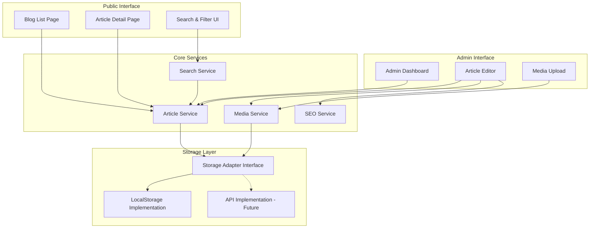

# Design Document: Dynamic Blog System

## Overview

### Purpose

This document defines the technical design for transforming the L'Maaza static blog (currently using `data.js`) into a dynamic blog system with full CRUD capabilities, rich content editing, categorization, search/filtering, SEO optimization, and multimedia support.

### Context

L'Maaza is a Togolese tech startup focused on innovation in agriculture, health, education, and environment sectors. The current blog implementation uses a static JavaScript array (`blogPosts` in `src/data.js`) rendered by React components (`Blog.jsx` and `Article.jsx`). While functional, this approach requires code changes for every content update and lacks administrative capabilities.

The new dynamic blog system will enable non-technical administrators to manage content through a web interface while maintaining the modern, accessible user experience and integrating seamlessly with the existing React/Tailwind CSS architecture.

### Goals

1. **Content Management**: Enable CRUD operations on blog articles without code changes
2. **Rich Authoring**: Provide a modern content editor with formatting, media embedding, and preview capabilities
3. **Organization**: Implement category and tag systems for content classification
4. **Discoverability**: Enable text search and multi-criteria filtering
5. **SEO Optimization**: Generate proper metadata and semantic HTML for search engines
6. **Media Support**: Handle image and video uploads with optimization
7. **Data Migration**: Preserve existing blog content during system transition
8. **Performance**: Maintain fast load times and responsive interactions
9. **Accessibility**: Ensure WCAG 2.1 AA compliance across all interfaces

### Technology Stack

**Frontend (Existing)**:
- React 18.3.1
- React Router DOM 7.9.3
- Tailwind CSS 3.4.18
- Lucide React (icons)
- React Helmet Async (SEO)

**New Dependencies**:
- **Rich Text Editor**: Lexical (Meta's extensible text editor framework) or TipTap (ProseMirror-based)
- **Storage**: localStorage (initial phase), with architecture supporting future backend API integration
- **Property-Based Testing**: fast-check (JavaScript/TypeScript property-based testing library)
- **Form Validation**: Custom validation hooks leveraging existing patterns

**Rationale for Lexical/TipTap**:
- Modern, actively maintained
- Extensible plugin architecture
- Accessibility built-in
- Output to HTML/JSON for storage
- Mobile-responsive editing experience

## Architecture

### High-Level Architecture



### Architectural Principles

1. **Separation of Concerns**: UI components remain presentation-focused; business logic resides in services
2. **Storage Abstraction**: Storage adapter pattern enables switching from localStorage to backend API without changing application code
3. **Unidirectional Data Flow**: React patterns (hooks, context) for state management
4. **Progressive Enhancement**: Core functionality works without JavaScript; enhancements layer on top
5. **Backward Compatibility**: Maintain existing React Router routes and URL structures

## Components and Interfaces

### Core Service Interfaces

#### ArticleService

```typescript
interface ArticleService {
  // Create
  createArticle(article: ArticleInput): Promise<Article>
  
  // Read
  getArticle(id: string): Promise<Article | null>
  getAllArticles(options?: QueryOptions): Promise<Article[]>
  getPublishedArticles(options?: QueryOptions): Promise<Article[]>
  
  // Update
  updateArticle(id: string, updates: Partial<ArticleInput>): Promise<Article>
  publishArticle(id: string): Promise<Article>
  unpublishArticle(id: string): Promise<Article>
  
  // Delete
  deleteArticle(id: string): Promise<void>
  
  // Search & Filter
  searchArticles(query: string, filters?: ArticleFilters): Promise<Article[]>
  getArticlesByCategory(category: Category): Promise<Article[]>
  getArticlesByTag(tag: string): Promise<Article[]>
}

interface QueryOptions {
  sortBy?: 'date' | 'title' | 'author'
  sortOrder?: 'asc' | 'desc'
  limit?: number
  offset?: number
}

interface ArticleFilters {
  category?: Category
  tags?: string[]
  status?: 'draft' | 'published'
  dateRange?: { start: Date, end: Date }
}
```

#### MediaService

```typescript
interface MediaService {
  uploadImage(file: File, altText?: string): Promise<MediaAsset>
  uploadVideo(file: File): Promise<MediaAsset>
  getMedia(id: string): Promise<MediaAsset | null>
  deleteMedia(id: string): Promise<void>
  
  // Optimization
  optimizeImage(imageId: string): Promise<MediaAsset>
  generateThumbnail(mediaId: string, size: ImageSize): Promise<string>
}

interface ImageSize {
  width: number
  height: number
  quality?: number
}
```

#### SearchService

```typescript
interface SearchService {
  indexArticle(article: Article): void
  searchFullText(query: string): Promise<SearchResult[]>
  highlightMatches(text: string, query: string): string
}

interface SearchResult {
  article: Article
  relevanceScore: number
  matchedFields: ('title' | 'excerpt' | 'content')[]
}
```

#### SEOService

```typescript
interface SEOService {
  generateSlug(title: string): string
  generateMetaDescription(content: string, maxLength: number): string
  generateCanonicalUrl(slug: string): string
  generateOpenGraphTags(article: Article): OpenGraphTags
  validateSEOMetadata(metadata: SEOMetadata): ValidationResult
}
```

### Storage Adapter Interface

```typescript
interface StorageAdapter {
  // Articles
  saveArticle(article: Article): Promise<void>
  getArticle(id: string): Promise<Article | null>
  getAllArticles(): Promise<Article[]>
  deleteArticle(id: string): Promise<void>
  
  // Media
  saveMedia(media: MediaAsset): Promise<void>
  getMedia(id: string): Promise<MediaAsset | null>
  getAllMedia(): Promise<MediaAsset[]>
  deleteMedia(id: string): Promise<void>
  
  // Batch operations
  saveMultipleArticles(articles: Article[]): Promise<void>
}
```

**LocalStorage Implementation Strategy**:
- Namespace keys with prefix: `lmaaza_blog_articles`, `lmaaza_blog_media`
- Store articles as JSON array
- Implement size limits and provide warnings when approaching localStorage quota (~5-10MB)
- Use compression for large content (optional enhancement)

**Future API Implementation**:
- RESTful endpoints following same interface contract
- JWT authentication for admin operations
- Multipart form-data for media uploads
- Pagination headers for large result sets

### Component Architecture

#### Public Components

**BlogListPage** (`src/pages/Blog.jsx` - Enhanced)
- Responsibilities: Display published articles, category/tag filtering, search interface, pagination
- State: articles list, search query, active filters, current page
- Dependencies: ArticleService, SearchService

**ArticleDetailPage** (`src/pages/Article.jsx` - Enhanced)
- Responsibilities: Display full article with rich content, SEO metadata injection, related articles
- State: current article, related articles
- Dependencies: ArticleService, SEOService

**SearchBar** (New Component)
- Responsibilities: Text input, real-time search suggestions, search submission
- Props: onSearch callback, placeholder text
- State: query text, suggestions

**ArticleCard** (Extracted from BlogListPage)
- Responsibilities: Display article preview with image, excerpt, metadata
- Props: article data, onClick handler
- Variants: Grid layout, list layout

**CategoryFilter** (New Component)
- Responsibilities: Category selection, visual indication of active category
- Props: categories, selectedCategory, onCategorySelect
- State: none (controlled component)

**TagCloud** (New Component)
- Responsibilities: Display popular tags, tag selection
- Props: tags with counts, selectedTags, onTagToggle
- State: none (controlled component)

**Pagination** (New Component)
- Responsibilities: Page navigation, current page indicator
- Props: totalItems, itemsPerPage, currentPage, onPageChange
- State: none (controlled component)

#### Admin Components

**AdminDashboard** (New Page)
- Route: `/admin/blog`
- Responsibilities: List all articles (draft + published), quick actions, sorting
- State: articles list, sort options, selected articles
- Dependencies: ArticleService
- Access Control: Requires admin role

**ArticleEditorPage** (New Page)
- Route: `/admin/blog/edit/:id` (edit), `/admin/blog/new` (create)
- Responsibilities: Article composition, metadata editing, preview, save/publish
- State: article data, editor state, validation errors, save status
- Dependencies: ArticleService, MediaService, SEOService

**RichTextEditor** (New Component)
- Responsibilities: Content editing with formatting toolbar, media insertion, HTML/Markdown output
- Props: initialContent, onChange, editorConfig
- State: editor instance, content, selection
- Library: Lexical or TipTap

**MediaLibrary** (New Component)
- Responsibilities: Display uploaded media, upload new files, select media for insertion
- Props: onMediaSelect, allowedTypes
- State: media list, upload progress, selected items
- Dependencies: MediaService

**SEOMetadataEditor** (New Component)
- Responsibilities: Edit SEO title, description, keywords; show character counts; display preview
- Props: metadata, onChange
- State: validation state, preview mode

**ArticlePreview** (New Component)
- Responsibilities: Render article as it will appear publicly
- Props: article data
- State: none (read-only)

## Data Models

### Article Model

```typescript
interface Article {
  // Identity
  id: string                    // UUID v4
  
  // Content
  title: string                 // Max 200 characters
  excerpt: string               // Max 200 characters
  content: string               // Rich HTML/Markdown
  
  // Classification
  category: Category
  tags: string[]                // Max 10 tags per article
  
  // Media
  featuredImage: MediaAsset | null
  
  // Metadata
  author: string
  readTime: number              // Minutes (calculated)
  slug: string                  // URL-friendly identifier
  
  // Status
  status: 'draft' | 'published'
  createdAt: string             // ISO 8601 timestamp
  updatedAt: string             // ISO 8601 timestamp
  publishedAt: string | null    // ISO 8601 timestamp
  
  // SEO
  seoMetadata: SEOMetadata
}

type Category = 
  | 'Agriculture'
  | 'Santé'
  | 'Éducation'
  | 'Environnement'
  | 'Formation'
  | 'Innovation'
  | 'Technologie'

interface SEOMetadata {
  title: string | null          // If null, use article title
  description: string | null    // If null, use excerpt (first 160 chars)
  keywords: string[]
  canonicalUrl: string
  openGraph: OpenGraphTags
}

interface OpenGraphTags {
  ogTitle: string
  ogDescription: string
  ogImage: string | null
  ogType: 'article'
  ogUrl: string
}
```

### MediaAsset Model

```typescript
interface MediaAsset {
  id: string                    // UUID v4
  type: 'image' | 'video'
  fileName: string
  mimeType: string
  size: number                  // Bytes
  url: string                   // Path or data URL for localStorage
  altText?: string              // Required for images (accessibility)
  thumbnail?: string            // For videos
  dimensions?: {                // For images
    width: number
    height: number
  }
  createdAt: string             // ISO 8601 timestamp
}
```

### Validation Rules

**Article Validation**:
- `title`: Required, 1-200 characters, non-whitespace
- `excerpt`: Required, 1-200 characters
- `content`: Required, minimum 100 characters
- `category`: Required, must be valid Category value
- `tags`: Optional, max 10 tags, each 1-50 characters
- `author`: Required, 1-100 characters
- `slug`: Auto-generated, unique, URL-safe
- `seoMetadata.title`: Optional, max 60 characters
- `seoMetadata.description`: Optional, max 160 characters
- `seoMetadata.keywords`: Optional, max 10 keywords

**Media Validation**:
- Image formats: PNG, JPEG, JPG, WebP, GIF, SVG
- Video formats: MP4, WebM, OGG
- Max file size: 10MB (images), 50MB (videos)
- Image dimensions: Min 400x300, Max 4000x4000
- `altText` required for images

### Data Migration Strategy

**Migration Script** (`scripts/migrateBlogData.js`):
```javascript
// Pseudo-code
function migrateExistingBlogPosts() {
  // 1. Load existing blogPosts from src/data.js
  const legacyPosts = require('../src/data').blogPosts
  
  // 2. Transform each post to new Article schema
  const migratedArticles = legacyPosts.map(post => ({
    id: generateUUID(),
    title: post.title,
    excerpt: post.excerpt,
    content: post.content || post.excerpt,
    category: post.category,
    tags: [],
    author: post.author,
    slug: generateSlug(post.title),
    status: 'published',
    readTime: post.readTime,
    featuredImage: null,    // Media mapped separately
    createdAt: parseLegacyDate(post.date),
    updatedAt: parseLegacyDate(post.date),
    publishedAt: parseLegacyDate(post.date),
    seoMetadata: {
      title: null,
      description: post.excerpt.slice(0, 160),
      keywords: [],
      canonicalUrl: generateCanonicalUrl(generateSlug(post.title)),
      openGraph: generateOpenGraph(post)
    }
  }))
  
  // 3. Store to new system
  articleService.saveMultipleArticles(migratedArticles)
}
```

### Slug Generation Algorithm

```
1. Convert title to lowercase
2. Replace accented characters: é→e, è→e, à→a, ê→e, ô→o, etc.
3. Replace non-alphanumeric characters with hyphens
4. Collapse consecutive hyphens into one
5. Remove leading/trailing hyphens
6. If slug already exists, append a counter: slug-2, slug-3, etc.
```

Example: `"L'Innovation Technologique au Service"` → `"linnovation-technologique-au-service"`

### Read Time Calculation

```
words = count words in plaintext content
readTimeMinutes = ceil(words / 200)    // 200 words per minute
return max(readTimeMinutes, 1)          // Minimum 1 minute
```

## Correctness Properties

*A property is a characteristic or behavior that should hold true across all valid executions of a system — essentially, a formal statement about what the system should do. Properties serve as the bridge between human-readable specifications and machine-verifiable correctness guarantees.*

**Property Reflection:**

Before defining the correctness properties, I reviewed all testable criteria identified in the prework to eliminate redundancy:

**Redundant Properties Identified:**
1. **1.1 (Article creation with draft status) and 8.1 (new articles have draft status)**: Same property - consolidate into one
2. **3.6 (filter by category), 3.7 (filter by tag), and 3.8 (click category/tag shows published)**: 3.8 subsumes 3.6 and 3.7 by adding published-only constraint - use 3.8 as the comprehensive property
3. **5.9 (lazy loading) and 12.2 (lazy loading)**: Exact duplicate - consolidate
4. **1.5 (published-only for regular users) and 3.8 (published-only when filtering)**: Both enforce published-only display - combine into "Published Article Visibility" property
5. **6.4 and 6.5 (SEO defaults)**: Both are default fallback properties - can be combined into one "SEO Default Values" property
6. **10.1 (persistent storage round-trip) and 5.7 (media storage round-trip)**: Both test persistence - combine into "Storage Persistence Round-Trip" property covering both articles and media

**Consolidation Strategy:**
- Combine related filtering properties (category, tag, status) into comprehensive filter properties
- Merge duplicate lazy loading properties
- Consolidate round-trip persistence properties
- Combine SEO default value properties
- Group validation properties by domain (image/video format validation)

This reflection reduces 40+ potential properties down to 20 unique, non-redundant properties.

### Property 1: Article Creation Initialization

*For any* valid ArticleInput data, when createArticle is called, the returned Article SHALL have:
- A non-empty unique `id`
- A valid ISO 8601 `createdAt` timestamp
- `status` equal to "draft"
- `updatedAt` equal to `createdAt`
- `publishedAt` equal to null

**Validates: Requirements 1.1, 8.1**

### Property 2: Article Update Preserves Identity and Updates Timestamp

*For any* existing Article and valid partial update data, when updateArticle is called, the returned Article SHALL:
- Preserve the original `id`
- Have `updatedAt` >= original `createdAt`
- Reflect all specified field updates
- Preserve unspecified fields unchanged

**Validates: Requirements 1.2**

### Property 3: Article Deletion Inverse

*For any* Article ID that exists in storage, after deleteArticle(id) executes successfully, getArticle(id) SHALL return null.

**Validates: Requirements 1.3**

### Property 4: Admin View Includes All Statuses

*For any* collection of articles with mixed statuses (draft and published), getAllArticles() SHALL return all articles regardless of status.

**Validates: Requirements 1.4**

### Property 5: Published Article Visibility Filtering

*For any* collection of articles with mixed statuses, getPublishedArticles() SHALL return only articles where `status === "published"`, and SHALL NOT return any articles where `status === "draft"`.

**Validates: Requirements 1.5, 3.8, 9.1**

### Property 6: Authorization Enforcement

*For any* CRUD operation (create, update, delete, publish) and a user context without admin role, the operation SHALL throw an authorization error and NOT modify data.

**Validates: Requirements 1.6, 7.8**

### Property 7: Content Serialization Round-Trip

*For any* valid editor content structure, serializing to HTML/Markdown format and then deserializing back SHALL produce equivalent content structure (preserving all formatting, links, media references).

**Validates: Requirements 2.8, 2.9**

### Property 8: Category Validation

*For any* string value, category validation SHALL accept the value if and only if it exactly matches one of the seven defined categories: Agriculture, Santé, Éducation, Environnement, Formation, Innovation, Technologie.

**Validates: Requirements 3.1, 3.2**

### Property 9: Tag Assignment Preservation

*For any* Article and any array of valid tag strings (up to maximum 10), after updating the article's tags, retrieving the article SHALL return exactly those tags in the same order.

**Validates: Requirements 3.3, 3.4**

### Property 10: Category Filtering Correctness

*For any* Category value and any collection of articles, getArticlesByCategory(category) SHALL return only published articles where `article.category === category`.

**Validates: Requirements 3.6, 3.8**

### Property 11: Tag Filtering Correctness

*For any* tag string and any collection of articles, getArticlesByTag(tag) SHALL return only published articles where `article.tags` includes the specified tag.

**Validates: Requirements 3.7, 3.8**

### Property 12: Search Scope Correctness

*For any* search query string and any published article that does NOT contain the query in its title, excerpt, or content fields, that article SHALL NOT appear in searchArticles(query) results.

**Validates: Requirements 4.2**

### Property 13: Search Relevance Ordering

*For any* search query that produces multiple results, articles with matches in the `title` field SHALL appear before articles with matches only in `excerpt` or `content` fields in the searchArticles(query) result list.

**Validates: Requirements 4.3**

### Property 14: Combined Filter Conjunction

*For any* search query, category filter, and tag filter, the result set SHALL only contain articles that satisfy ALL specified filters:
- If category is specified: `article.category === category`
- If tag is specified: `article.tags.includes(tag)`
- If query is specified: query appears in title, excerpt, or content
- `article.status === "published"`

**Validates: Requirements 4.4, 4.5**

### Property 15: Highlight Preservation

*For any* text string and search query, the highlightMatches(text, query) function SHALL return a string that, when all highlight markup is stripped, equals the original text exactly (no text content is added or removed, only markup).

**Validates: Requirements 4.7**

### Property 16: Media Format Validation

*For any* file:
- Image validation SHALL accept if and only if MIME type is in {image/png, image/jpeg, image/jpg, image/webp, image/gif, image/svg+xml}
- Video validation SHALL accept if and only if MIME type is in {video/mp4, video/webm, video/ogg}

**Validates: Requirements 5.1, 5.2**

### Property 17: Media Storage Round-Trip

*For any* valid MediaAsset with all required fields (including altText for images), after saveMedia(asset) executes, getMedia(asset.id) SHALL return a MediaAsset equivalent to the original with all fields preserved.

**Validates: Requirements 5.6, 5.7**

### Property 18: Lazy Loading Attribute

*For any* rendered article content containing multiple images, all image elements except the featured image (first image) SHALL have the `loading="lazy"` HTML attribute.

**Validates: Requirements 5.9, 12.2**

### Property 19: SEO Default Fallback Values

*For any* Article where `seoMetadata.title` is null, the effective SEO title SHALL equal `article.title`.

*For any* Article where `seoMetadata.description` is null, the effective SEO description SHALL equal the first 160 characters of `article.excerpt`.

**Validates: Requirements 6.4, 6.5**

### Property 20: Slug Generation URL Safety

*For any* article title string, generateSlug(title) SHALL return a string that:
- Contains only lowercase alphanumeric characters, hyphens, and no other special characters
- Contains no accented characters (é, è, à, ê, ô, etc.)
- Contains no consecutive hyphens
- Contains no leading or trailing hyphens
- Is non-empty

**Validates: Requirements 6.9**

### Property 21: Canonical URL Consistency

*For any* article slug, generateCanonicalUrl(slug) SHALL return a URL string that contains the slug and follows a consistent base URL pattern.

**Validates: Requirements 6.6**

### Property 22: Open Graph Tag Completeness

*For any* Article, generateOpenGraphTags(article) SHALL return an object containing all required Open Graph fields: ogTitle (non-empty), ogDescription (non-empty), ogType (value "article"), and ogUrl (valid URL format).

**Validates: Requirements 6.8**

### Property 23: SEO Metadata Injection

*For any* published Article, when rendered to HTML, the document head SHALL include:
- A `<title>` tag containing the effective SEO title
- A `<meta name="description">` tag containing the effective SEO description
- A `<link rel="canonical">` tag containing the canonical URL

**Validates: Requirements 6.7**

### Property 24: Publish Status Transition

*For any* Article with `status === "draft"`, after publishArticle(id) executes, the returned Article SHALL have:
- `status === "published"`
- `publishedAt` containing a valid ISO 8601 timestamp
- `updatedAt` >= original `updatedAt`

**Validates: Requirements 8.3**

### Property 25: Unpublish Status Transition

*For any* Article with `status === "published"`, after unpublishArticle(id) executes, the returned Article SHALL have:
- `status === "draft"`
- `publishedAt` unchanged (preserves original publication date)
- `updatedAt` >= original `updatedAt`

**Validates: Requirements 8.4**

### Property 26: Default Sort Order

*For any* collection of published articles with different `publishedAt` timestamps, getPublishedArticles() with default sorting SHALL return articles in descending order of `publishedAt` (newest first).

**Validates: Requirements 9.2**

### Property 27: Article Card Data Completeness

*For any* published Article rendered as an article card, the rendered output SHALL include all required fields: featuredImage (or placeholder), title, excerpt, author, date, category, and readTime.

**Validates: Requirements 9.3**

### Property 28: Pagination Boundary Correctness

*For any* collection of N articles where N > 0 and page size of 12:
- The pagination function SHALL produce exactly `Math.ceil(N / 12)` pages
- Each page SHALL contain at most 12 articles
- The last page SHALL contain exactly `N mod 12` articles (or 12 if `N mod 12 === 0`)
- All articles SHALL appear exactly once across all pages

**Validates: Requirements 9.6**

### Property 29: Related Article Relevance

*For any* Article A, all articles returned by getSuggestedRelatedArticles(A) SHALL share at least one of the following with A:
- Same `category` value, OR
- At least one tag in common (intersection of `tags` arrays is non-empty)

**Validates: Requirements 9.7**

### Property 30: Article Storage Persistence Round-Trip

*For any* valid Article, after saveArticle(article) executes, getArticle(article.id) SHALL return an Article with all fields equal to the original.

**Validates: Requirements 10.1**


## Error Handling

### Error Categories

#### Storage Errors

```typescript
class StorageError extends Error {
  code: 'STORAGE_QUOTA_EXCEEDED' | 'STORAGE_UNAVAILABLE' | 'ITEM_NOT_FOUND'
  recoverable: boolean
}
```

**Quota Exceeded (localStorage ~5-10MB limit)**:
- Strategy: Display warning banner showing current usage
- Prevention: Enforce max content size per article (warn at 80% quota)
- Recovery: Prompt to delete unused articles or migrate to backend
- User message: "Espace de stockage presque plein. Veuillez supprimer d'anciens articles ou contacter l'administrateur."

**Storage Unavailable (private browsing, disabled localStorage)**:
- Strategy: Display persistent error banner
- Recovery: Session-only in-memory storage as fallback
- User message: "Le système de stockage est indisponible. Les données ne seront pas conservées."

**Item Not Found**:
- Strategy: Return null from service layer, component handles null state
- User message: "Article non trouvé." with link back to blog list

#### Validation Errors

```typescript
interface ValidationError {
  field: string
  message: string
  code: 'REQUIRED' | 'TOO_LONG' | 'INVALID_FORMAT' | 'INVALID_VALUE'
}
```

- Display inline field-level errors immediately on blur or submit attempt
- Prevent save/publish when required fields are invalid
- Preserve user input during validation — do not clear form on error

#### Media Upload Errors

```typescript
class MediaUploadError extends Error {
  code: 'INVALID_FORMAT' | 'FILE_TOO_LARGE' | 'UPLOAD_FAILED'
  file?: File
}
```

- Invalid format: "Format de fichier non supporté. Formats acceptés : PNG, JPEG, WebP, GIF, SVG"
- File too large: "Le fichier dépasse la taille maximale autorisée (10 Mo pour les images)"
- Upload failed: "L'upload a échoué. Veuillez réessayer."

#### Authorization Errors

```typescript
class AuthorizationError extends Error {
  code: 'UNAUTHORIZED' | 'FORBIDDEN'
  requiredRole?: string
}
```

- Unauthenticated: Redirect to login page (`/login`)
- Insufficient role: Redirect to login with message "Accès administrateur requis"
- All admin routes must guard against unauthorized access using React Router protection

### Error Boundaries

Wrap the admin section and blog list in React Error Boundaries:
- Admin: Catch unexpected errors, show "Une erreur est survenue. Vos données sont sauvegardées." with refresh button
- Blog public: Catch rendering errors, show simplified fallback with static content link

### Network and Async Errors

For all async operations (storage, future API):
- Use try/catch blocks in service layer
- Propagate meaningful error instances (not raw strings)
- All loading states should have timeout handling (15s maximum for storage operations)
- Display toast notifications for non-blocking errors (save succeeded, article published, etc.)

## Testing Strategy

### Overview

The testing strategy combines three complementary approaches:
1. **Property-Based Tests** — verify universal correctness properties across randomly generated inputs
2. **Example-Based Unit Tests** — verify specific concrete behaviors, UI interactions, and edge cases
3. **Integration Tests** — verify component composition and storage layer behavior

### Property-Based Testing

**Library**: `fast-check` (MIT licensed, well-maintained, works with Jest/React Testing Library)

**Configuration**:
- Minimum 100 iterations per property test
- Seed-based reproduction of failures
- Each test tagged with feature name and property number

**Tag Format**:
```javascript
// Feature: dynamic-blog-system, Property N: [property title]
it('should satisfy property N - [title]', () => {
  fc.assert(fc.property(
    fc.record({ ... }),
    (input) => { /* property assertion */ }
  ), { numRuns: 100 })
})
```

**Priority Properties for PBT Implementation** (highest value for correctness validation):

| Property | Test Target | Key Generators |
|----------|-------------|----------------|
| P1: Article Creation Init | `createArticle()` | `fc.record({title, content, category})` |
| P5: Published Visibility | `getPublishedArticles()` | `fc.array(fc.record({status: fc.oneof(...)}))` |
| P7: Content Serialization Round-Trip | `serialize/deserialize()` | Content state structures |
| P8: Category Validation | `validateCategory()` | `fc.string()` |
| P12: Search Scope | `searchArticles()` | Articles + query strings |
| P15: Highlight Preservation | `highlightMatches()` | Text + query |
| P16: Media Format Validation | `validateMediaFile()` | MIME type strings |
| P20: Slug URL Safety | `generateSlug()` | `fc.string()` including Unicode |
| P28: Pagination Boundary | `paginate()` | `fc.nat()` for N |

### Example-Based Unit Tests

**Files**: `src/services/__tests__/`, `src/components/__tests__/`

Target behaviors:
- Rich text editor formatting toolbar renders correct buttons
- Article card renders all required fields with mock data
- SEO component injects correct meta tags
- Admin dashboard renders article list with correct status badges
- Delete confirmation dialog shows before deletion
- Redirect to login for unauthorized admin access
- Empty search results message renders
- Video element renders with controls attribute

### Integration Tests

**Files**: `src/__tests__/integration/`

Target scenarios:
- Full CRUD cycle: create article, edit, publish, view in public blog, delete
- Migration script transforms legacy blogPosts to new Article schema correctly
- localStorage adapter save/retrieve round-trip for articles
- Filter combination: category + text search returns correct subset
- Pagination: 15 articles split correctly across 2 pages

### Accessibility Tests

- Jest Axe for automated WCAG 2.1 AA checks on rendered components
- Manual testing checklist for keyboard navigation in admin editor
- Screen reader label verification for all interactive elements

### Performance Tests

- Bundle size monitoring: warn if blog JS chunk exceeds 100KB
- Lighthouse CI integration for main blog page (target: Performance score ≥ 80 on simulated 3G)

### Test File Structure

```
src/
├── services/
│   ├── articleService.js
│   ├── mediaService.js
│   ├── searchService.js
│   ├── seoService.js
│   └── __tests__/
│       ├── articleService.property.test.js  (PBT with fast-check)
│       ├── searchService.property.test.js
│       ├── seoService.property.test.js
│       └── mediaService.property.test.js
├── utils/
│   ├── validation.js
│   ├── slugUtils.js
│   ├── paginationUtils.js
│   └── __tests__/
│       ├── validation.property.test.js
│       ├── slugUtils.property.test.js
│       └── paginationUtils.property.test.js
└── __tests__/
    └── integration/
        ├── crudCycle.test.js
        └── migrationScript.test.js
```

### Migration Validation

The data migration script (`scripts/migrateBlogData.js`) should have test coverage verifying:
- All 4 existing blog posts are transformed with no data loss
- Each migrated article has `status === "published"`
- Each migrated article has a unique UUID-based ID
- All dates are correctly parsed from French locale format ("15 Décembre 2024") to ISO 8601
- Slugs are generated correctly from titles (including French accent normalization)
